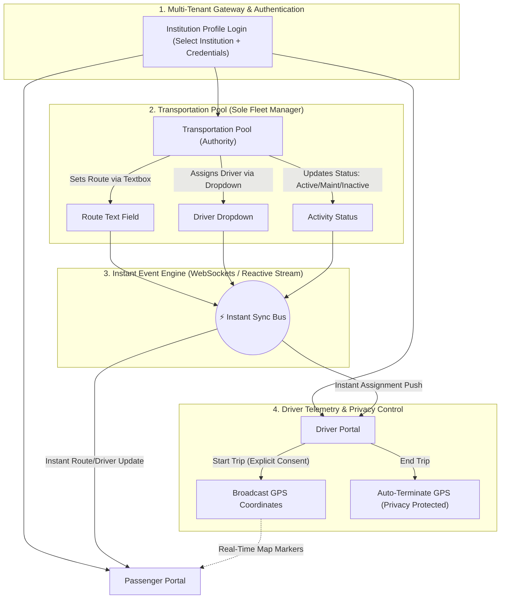

# Software Requirements Specification (SRS)
## FleetSync — SaaS-Based Multi-Tenant Vehicle Management & Real-Time Tracking System

**Document Version:** 2.0 (Final Release)  
**Standard Compliance:** IEEE Std 830-1998  
**Project Phase:** Step 1 of 3 (SRS $\rightarrow$ Design $\rightarrow$ Implementation)  
**Target Platform:** Responsive Web Application & Mobile Progressive Web App (PWA)  
**Author / Engineering Team:** FleetSync Core Systems Architecture Team  
**Date:** September 2026  

---

## Document Revision History

| Version | Date | Author | Summary of Changes |
|---|---|---|---|
| 0.1 | Early Draft | Initial Author | Initial single-school transport concept. |
| 1.0 | Sep 14, 2026 | Architecture Team | Expanded to SaaS multi-tenant platform with 4 roles. |
| 1.1 | Sep 14, 2026 | Architecture Team | Removed Admin role; consolidated fleet management to Transportation Pool (Authority); introduced Route Text Box and Driver Dropdown; added Driver Privacy Protection. |
| 2.0 | Sep 14, 2026 | Architecture Team | **Final Release:** Integrated Smart Route Delimiter Parser and Graceful Signal Fallback ("Last Seen" Badge); finalized IEEE 830 compliance and prepared Word (.docx) publication. |

---

## 1. Introduction

### 1.1 Purpose
This Software Requirements Specification (SRS) document details the complete functional, non-functional, external interface, and architectural requirements for **FleetSync**. It provides the definitive technical baseline agreed upon by stakeholders and developers, serving as the blueprint for **System Architecture & Design (Step 2)** and **Feature-by-Feature Implementation (Step 3)**.

### 1.2 Document Conventions
- **MUST / SHALL:** Absolute requirements mandatory for the operational baseline.
- **SHOULD:** Highly recommended requirements to ensure usability, security, and market viability.
- **MAY:** Optional or future enhancements planned for post-MVP iterations.
- Requirement Identifiers follow the format `[FR-<MODULE>-<NUMBER>]` for functional requirements and `[NFR-<CATEGORY>-<NUMBER>]` for non-functional requirements.

### 1.3 Intended Audience
This document is prepared for:
- **System Architects & Software Engineers:** To implement the data schemas, real-time messaging, and application interfaces.
- **Project Evaluators & Course Instructors:** To verify engineering rigor, requirement completeness, and project scope.
- **End-User Stakeholders (Authorities, Drivers, Passengers):** To understand the system boundaries and interaction workflows.

### 1.4 Project Scope
**FleetSync** is a multi-tenant Software-as-a-Service (SaaS) platform providing unified vehicle fleet management, dynamic driver dispatching, and live commuter tracking. The system serves educational institutions (universities, colleges, schools), corporate campuses, and organizational logistics departments.

Key distinguishing capabilities:
- **Zero Dedicated Hardware:** Operates entirely through modern web browsers utilizing HTML5 Geolocation API (`navigator.geolocation`) on drivers' smartphones, eliminating the need for expensive OBD-II GPS hardware.
- **Multi-Tenant Data Partitioning:** Allows hundreds of distinct institutions to securely use the same platform instance with complete data isolation.
- **Consolidated Fleet Authority:** The **Transportation Pool (Authority)** serves as the sole operational manager, configuring vehicle routes via a simple text box and assigning drivers via an intuitive dropdown.
- **Driver Privacy by Design:** GPS tracking is strictly active during an in-progress trip and terminates automatically upon completion.
- **Instant Synchronization:** Updates made to vehicle routes, drivers, or statuses propagate in real time to drivers and passengers without page reloads.

---

## 2. Overall Description

### 2.1 Product Perspective
FleetSync is an independent, cloud-native web application built using modern web technologies. It is structured around a multi-tenant shared database architecture with tenant isolation enforced at the data-access layer via `institutionId`.



### 2.2 User Classes and Characteristics
The platform explicitly defines **three (3) user roles** per institution:

1. **Transportation Pool / Authority (Fleet Dispatcher & Manager):**
   - *Profile:* Transport coordinators, pool supervisors, or institutional fleet managers.
   - *Responsibilities:* Exclusive authority over vehicle records, route text configurations, driver dropdown assignments, and fleet operational statuses.
   - *Technical Competency:* Moderate computer literacy; interacts via a desktop/tablet web dashboard.

2. **Driver:**
   - *Profile:* Institutional bus, shuttle, or van drivers.
   - *Responsibilities:* Operates assigned vehicles; starts and ends scheduled trips; broadcasts real-time GPS coordinates.
   - *Technical Competency:* Basic mobile smartphone literacy; operates through a simplified, large-button mobile interface.

3. **Passenger (Students, Faculty, Staff, Commuters):**
   - *Profile:* Institutional commuters waiting at transit stops or campus stations.
   - *Responsibilities:* Selects vehicle numbers from a dropdown; monitors live vehicle position on a map; checks route stops; contacts the driver directly.
   - *Technical Competency:* General mobile/web literacy.

### 2.3 Operating Environment
- **Client Tier:** Modern web browsers supporting ECMAScript 2022+ and HTML5 Geolocation (Google Chrome 90+, Mozilla Firefox 88+, Apple Safari 14+, Microsoft Edge 90+). Mobile responsive (Android Chrome, iOS Safari).
- **Server Tier:** Node.js (v18+ LTS / v20+) runtime environment.
- **Database Tier:** PostgreSQL relational database with Prisma ORM.
- **Hosting Tier:** Cloud hosting (Vercel / AWS / Docker containerized).

### 2.4 Design and Implementation Constraints
- **Hardware Agnostic:** System must not depend on proprietary GPS/OBD hardware or third-party paid mobile app stores.
- **Browser Security Restrictions:** The Geolocation API mandates secure origins (`HTTPS` in production, `localhost` in local development).
- **Network Variability:** Must gracefully handle cellular disconnections, dead zones, and reconnect events.

### 2.5 Assumptions and Dependencies
- Drivers possess internet-connected smartphones with integrated GPS sensors.
- Users grant one-time browser permission for location access when prompted.
- Third-party open mapping tiles (OpenStreetMap via Leaflet) remain accessible.

---

## 3. System Features & Functional Requirements

### 3.1 Module 1: Multi-Tenant Institution Onboarding & Authentication

#### FR-AUTH-01: Institution Profile Discovery and Selection
- The system shall provide an institution selection mechanism on the login screen, allowing users to pick their institution from a searchable list or access via an institutional subdomain/slug.
- All subsequent authentication and session states must be scoped to the chosen `institutionId`.

#### FR-AUTH-02: Secure Institutional Authentication
- Users must authenticate using their registered email/username and password.
- Passwords must be hashed using `bcrypt` (salt rounds $\ge 10$).
- Sessions must be managed via encrypted JSON Web Tokens (JWT) or secure HTTP-only session cookies.

#### FR-AUTH-03: Role-Based Dashboard Redirection
- Upon successful authentication, the system must immediately redirect users to their designated role console:
  - `AUTHORITY` $\rightarrow$ `/authority/dashboard`
  - `DRIVER` $\rightarrow$ `/driver/console`
  - `PASSENGER` $\rightarrow$ `/passenger/track`

#### FR-AUTH-04: Tenant Isolation Enforcement
- Every database query and mutation must enforce a strict `WHERE institutionId = session.institutionId` filter. Cross-tenant access attempts must be rejected with HTTP 403 Forbidden.

---

### 3.2 Module 2: Transportation Pool / Authority (Exclusive Vehicle Management)
*The Transportation Pool is the sole entity authorized to create and modify vehicle information.*

#### FR-POOL-01: Vehicle Roster Management
- The Authority can register, view, update, and decommission fleet vehicles.
- Vehicle entity fields: `id`, `institutionId`, `vehicleNumber` (e.g., "Bus #04"), `plateNumber` (e.g., "DHA-METRO-KA-11-2233"), `model`, `capacity`, `currentStatus`, `assignedRoute`, `assignedDriverId`.

#### FR-POOL-02: Route Configuration via Text Box
- The Authority shall configure or update the route of any vehicle using an editable **Text Box** (e.g., `"Route 5: Mirpur 10 -> Kazipara -> Agargaon -> Farmgate -> Main Campus"`).
- The input supports standard delimiters (`->`, `-->`, or `,`) separating distinct stop milestones.

#### FR-POOL-03: Driver Assignment via Dropdown
- The Authority shall assign a driver to a vehicle using an intuitive **Driver Dropdown Selector** populated with all active drivers belonging to that institution.
- *Conflict Prevention:* If a driver is currently assigned to another vehicle, the dropdown shall clearly indicate their current assignment (e.g., `"Jane Doe (Currently Bus #02)"`). Assigning them to a new vehicle automatically unbinds them from their previous vehicle.

#### FR-POOL-04: Vehicle Activity Status Control
- The Authority can toggle/select the operational status of any vehicle from a controlled list:
  - `ACTIVE`: Available for daily scheduled operations.
  - `ON_TRIP`: Currently active on the road.
  - `MAINTENANCE`: Out of service for mechanical repair or scheduled inspection.
  - `INACTIVE`: Decommissioned or idle.

#### FR-POOL-05: Instant Cross-System Synchronization
- Any mutation made by the Authority to a vehicle's **route text, assigned driver, or activity status** shall be broadcast immediately across the system via WebSockets or Server-Sent Events (SSE).
- Driver screens and Passenger screens watching that vehicle must update their view **instantly without requiring a manual browser refresh**.

---

### 3.3 Module 3: Driver Portal & Mandatory Privacy Protection

#### FR-DRV-01: Assigned Vehicle Display
- Upon logging in, the driver's interface prominently displays their current assignment:
  - **Assigned Vehicle Number & Plate**
  - **Assigned Route** (updated live from the Authority's text box)
  - **Current Vehicle Status**
- If no vehicle is currently assigned, the screen displays a clear waiting notice: *"No vehicle currently assigned by Transportation Pool"*.

#### FR-DRV-02: Trip Lifecycle Control
- The driver initiates a trip by clicking a prominent **"Start Trip"** button.
- The system updates the vehicle status to `ON_TRIP`, notes the trip start timestamp, and begins active GPS broadcasting.
- The driver concludes the trip by clicking **"End Trip"**, which transitions status to `COMPLETED` and deactivates GPS transmission.

#### FR-DRV-03: Mandatory Driver Privacy Protection (Core Mandate)
- **Strict Trip Binding:** GPS coordinates shall be captured and broadcast **strictly and exclusively** during an active trip (`IN_PROGRESS`).
- **Explicit Visual Status:** When a trip is active, the driver screen displays a pulsing visual banner: `🔴 Live Location Sharing is ACTIVE`.
- **Immediate Termination:** The moment the driver clicks "End Trip", all geolocation listeners (`navigator.geolocation.clearWatch`) are terminated instantly.
- **Zero Off-Duty Tracking:** The system shall never request, record, or store location coordinates while the driver is off-duty, logged out, or between trips.
- **Terminal Auto-Stop Safeguard:** If a vehicle remains stationary at the destination terminus for longer than 15 consecutive minutes, the system prompts the driver and automatically concludes the trip to prevent inadvertent tracking.

#### FR-DRV-04: Instant Reassignment Alert
- If the Transportation Pool reassigns the driver to another vehicle or updates the route while the driver is logged in, an in-app banner immediately informs the driver: *"Notice: Your vehicle assignment has been updated by Transportation Pool"*.

---

### 3.4 Module 4: Passenger Portal ("Where's My Bus / Shuttle")

#### FR-PAS-01: Vehicle Selector Dropdown
- The passenger interface features a clean, responsive **Vehicle Number Dropdown** (e.g., *"Bus #04 [DHA-METRO-KA-11-2233] — Route 3"*).
- Vehicles under `MAINTENANCE` or `INACTIVE` are visibly badged and disabled from selection.

#### FR-PAS-02: Live Interactive Map Tracking
- Selecting a vehicle renders an interactive Leaflet/OpenStreetMap view centered on the vehicle's real-time position.
- As the driver's device streams updated GPS coordinates, the map marker animates smoothly across the map without page reloading.
- If the trip has not yet started, the map displays an informational card: *"Trip has not started yet — Scheduled Route: [Route Text]"*.

#### FR-PAS-03: Smart Route Delimiter Parser (Recommendation 1)
- The system automatically parses the raw route text configured by the Transportation Pool text box (e.g., `"Stop A -> Stop B -> Stop C"` or `"Stop A, Stop B, Stop C"`).
- The passenger interface renders this string into a clean, visual **Milestone Timeline / Stepper**, allowing commuters to easily view the sequence of stops without requiring manual GPS waypoint configuration by administrators.

#### FR-PAS-04: Graceful Signal Fallback & "Last Seen" Badge (Recommendation 3)
- If a driver enters a cellular dead zone, disconnects, or experiences device power loss mid-trip:
  - The map shall **not** crash, go blank, or disappear.
  - The vehicle marker remains visible at the last reported coordinate.
  - The marker status turns amber, displaying a prominent **"Last Seen" Badge**:  
    `⚠️ Signal Lost — Last updated 3 minutes ago`.
  - Once the driver reconnects, the marker returns to green `LIVE` status seamlessly.

#### FR-PAS-05: Driver Information & One-Touch Direct Call
- The passenger screen displays a dedicated driver contact card:
  - **Driver's Full Name**
  - **Driver's Direct Phone Number**
  - **One-Touch Call Button:** Embedded with standard `tel:<phone_number>` protocol, enabling commuters to call the driver immediately from their smartphone in case of missed stops or lost belongings.
  - Assigned Vehicle Number and Plate.

---

## 4. External Interface Requirements

### 4.1 User Interfaces
- **Responsive Layout:** Dynamic UI adapting from desktop widescreen (Authority Console) to mobile handheld screens (Driver & Passenger views).
- **High-Contrast Touch Targets:** Driver interface buttons (*Start Trip*, *End Trip*) designed with minimum dimensions of $56\times56\text{px}$ for safe in-vehicle operation.
- **Mapping Framework:** Leaflet.js integrating OpenStreetMap cartographic tiles.

### 4.2 Hardware Interfaces
- Standard smartphone GPS/GNSS receiver (integrated within mobile hardware, accessed via web browser APIs).

### 4.3 Software Interfaces
- **W3C Geolocation API:** Standard browser interface `navigator.geolocation.watchPosition` for reading latitude, longitude, heading, speed, and accuracy.
- **Relational Storage:** PostgreSQL database accessed through Prisma ORM.

### 4.4 Communications Interfaces
- **Transport Security:** Strict HTTPS (TLS 1.3) encryption across all endpoints.
- **Telemetry Messaging:** Full-duplex WebSockets (`wss://`) or HTTP Server-Sent Events (SSE) for low-latency live location streaming.
- **Telephony Interface:** Universal URI scheme `tel:` for mobile dialer integration.

---

## 5. Non-Functional Requirements (NFRs)

### 5.1 Performance & Latency
- **[NFR-PERF-01] Telemetry Latency:** GPS position update latency from driver device to passenger screen shall not exceed **2.0 seconds** over active cellular data connections.
- **[NFR-PERF-02] Instant Synchronization:** Authority vehicle updates (route, driver, status) must reflect on all connected client screens within **1.0 second**.
- **[NFR-PERF-03] Page Load Time:** Initial interactive view for passenger tracking must render within **1.5 seconds** on a 4G mobile network.

### 5.2 Security & Data Privacy
- **[NFR-SEC-01] Tenant Sandboxing:** Total logical segregation between distinct institutions. No query may resolve cross-tenant data.
- **[NFR-SEC-02] Least Privilege:** Drivers and passengers must have zero access to administrative mutation endpoints.
- **[NFR-SEC-03] Driver Privacy Compliance:** Location tracking strictly limited to active operational runs; historical telemetry is anonymized or purged per institutional retention policy.

### 5.3 Reliability & Availability
- **[NFR-REL-01] Service Availability:** Target uptime of 99.5% during operational transit hours.
- **[NFR-REL-02] Reconnection Resilience:** Web client automatically attempts WebSocket reconnection using exponential backoff (1s, 2s, 4s, up to 15s) upon temporary signal drop.

### 5.4 Usability & Accessibility
- **[NFR-USE-01] Single-Handed Operation:** Driver console operational with single-touch actions without requiring text typing while on duty.
- **[NFR-USE-02] Accessibility:** Color-contrast ratios meet WCAG 2.1 AA standards for outdoor sunlight readability.

---

## 6. Verification and Traceability Matrix

| Requirement ID | Description | Primary Role | Verification Method |
|---|---|---|---|
| **FR-AUTH-01** | Institution profile selection & discovery | All | User testing / Functional inspection |
| **FR-AUTH-02** | Institutional authentication & bcrypt hash | All | Automated integration test |
| **FR-AUTH-03** | Role-based redirection to dedicated consoles | All | Unit test / End-to-end test |
| **FR-AUTH-04** | Strict multi-tenant data isolation | System | Automated security audit query |
| **FR-POOL-01** | Vehicle CRUD roster | Authority | Functional UI test |
| **FR-POOL-02** | Route configuration via text box | Authority | Functional UI test |
| **FR-POOL-03** | Driver assignment via dropdown | Authority | Functional UI test & double-booking validation |
| **FR-POOL-04** | Vehicle activity status control | Authority | Status transition testing |
| **FR-POOL-05** | Instant real-time synchronization | Authority $\rightarrow$ All | WebSocket event latency test |
| **FR-DRV-01** | Assigned vehicle and route display | Driver | Mobile UI inspection |
| **FR-DRV-02** | Trip lifecycle (Start/End Trip) | Driver | State machine integration test |
| **FR-DRV-03** | Mandatory Driver Privacy Protection | Driver | Geolocation listener lifecycle audit |
| **FR-DRV-04** | Instant reassignment alert banner | Driver | Real-time push test |
| **FR-PAS-01** | Vehicle selection dropdown | Passenger | Responsive mobile UI test |
| **FR-PAS-02** | Live interactive Leaflet map | Passenger | Live browser map rendering test |
| **FR-PAS-03** | Smart Route Delimiter Parser | Passenger | Regex/delimiter unit tests |
| **FR-PAS-04** | Graceful Fallback ("Last Seen" badge) | Passenger | Network disconnection simulation |
| **FR-PAS-05** | Driver info card & one-touch calling | Passenger | Mobile `tel:` protocol execution test |

---

## 7. 3-Step Execution Roadmap

```
┌──────────────────────────────────────────────────────────────────┐
│ STEP 1: Software Requirements Specification (SRS) [APPROVED]     │
│  - IEEE 830-1998 Compliant Specification Document                │
│  - Multi-Tenant Foundation, Authority Exclusivity, Driver Privacy│
│  - Smart Delimiter Parser & Graceful Signal Fallback Integrated  │
│  - Published as docs/SRS.md & docs/FleetSync_SRS_Final.docx      │
└────────────────────────────────┬─────────────────────────────────┘
                                 │
                                 ▼
┌──────────────────────────────────────────────────────────────────┐
│ STEP 2: System Architecture & Detailed Design                    │
│  - Multi-Tenant Relational ERD (Prisma Schema)                   │
│  - Real-Time Synchronization Protocol (WebSockets / SSE)         │
│  - Wireframes & UI Component Architecture                        │
│  - REST & Server Action API Specifications                       │
└────────────────────────────────┬─────────────────────────────────┘
                                 │
                                 ▼
┌──────────────────────────────────────────────────────────────────┐
│ STEP 3: Feature-by-Feature Implementation                        │
│  - F1: Multi-Tenant Institution Login & Session Guard            │
│  - F2: Transportation Pool Console (Route Box, Driver Dropdown)  │
│  - F3: Driver Console with Privacy-Protected GPS Broadcaster     │
│  - F4: Passenger Real-Time Tracker (Dropdown, Map, Call Button)  │
│  - F5: Smart Route Delimiter Parser & "Last Seen" Fallback       │
│  - F6: End-to-End Real-Time Event Sync & Deployment              │
└──────────────────────────────────────────────────────────────────┘
```
